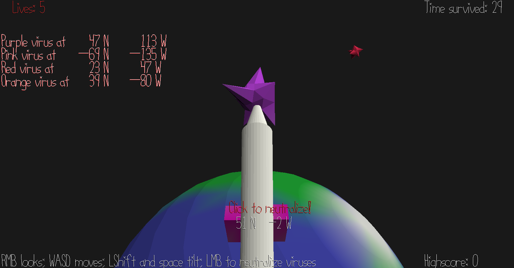

# Global Pandemic Defense

Author: Kyle Jannak-Huang

Design: This game features the same pink robot from my previous games, but now he is tasked with defending the Earth from invading alien viruses.
The robot rolls around the atmosphere of the Earth, destroying any viruses that come too close.

Screen Shot:

How To Play:

Controls:

Hold right click and move mouse to rotate the camera and robot. Use WASD to move.

Use left shift and space to tilt the virus-blasting mechanism up and down.

Left-click to blast a virus when they are close.

Details:

The viruses are colored and will always spawn in a certain order, so they are easier to keep track of. As you survive longer, they will spawn more frequently and hurtle towards the Earth faster.
You will also gain movement speed so you can keep up.

The left-hand side of the screen displays the latitude and longitude of detected viruses. The game would be pretty impossible otherwise. Below your character on screen you can see your own coordinates.

Sources: I created all the assets myself using default shapes and vertex paint in Blender.

This game was built with [NEST](NEST.md).

